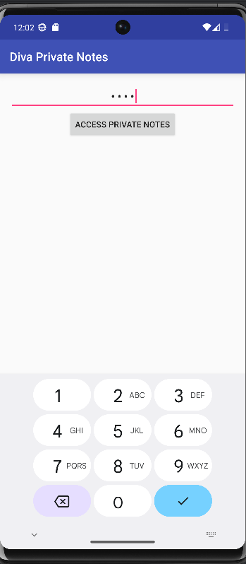
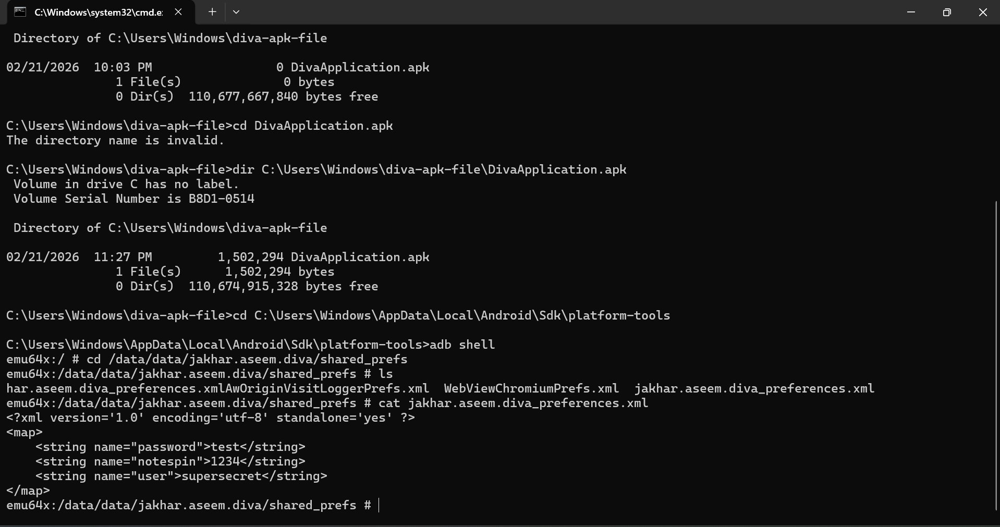
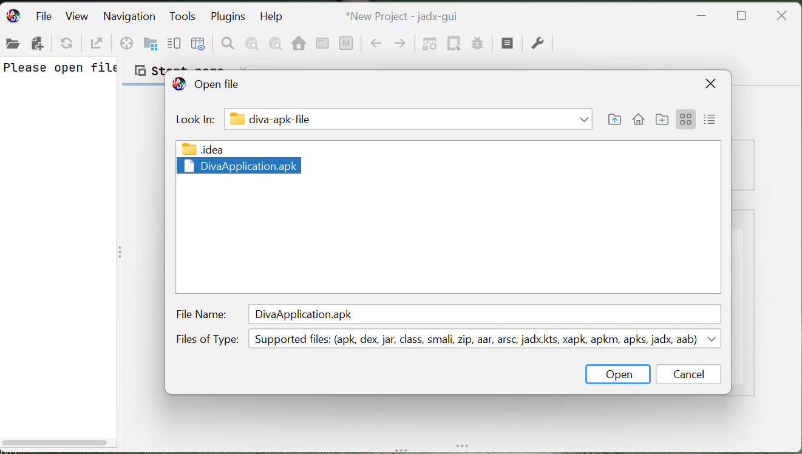
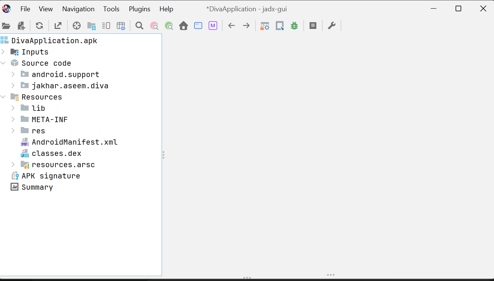
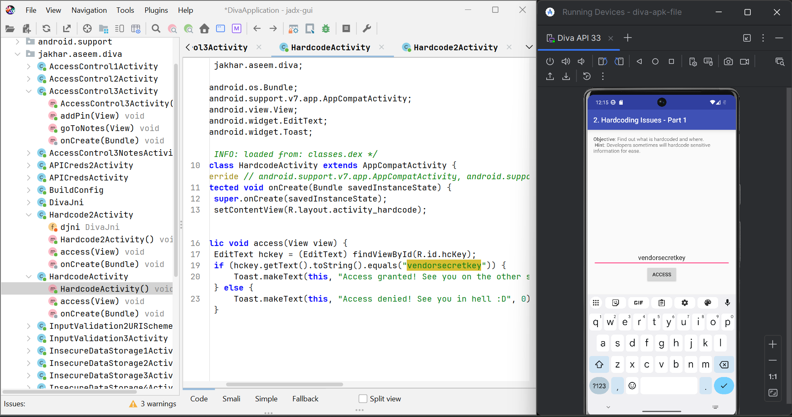
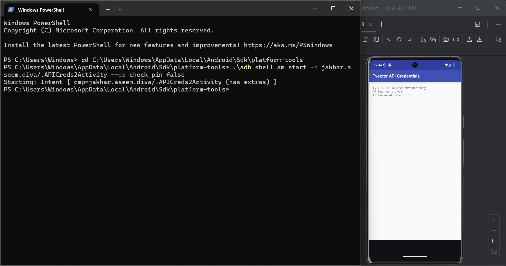
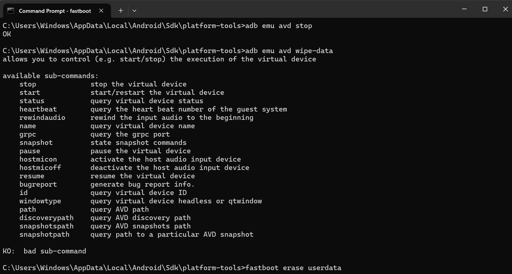

# Lab 2 — Audit de sécurité Android

*Par Kaoutar — Test des vulnérabilités sur environnement rooté*

---

## 1. Périmètre d'intervention

| Élément | Description |
|---------|-------------|
| Application | Diva v|
| Environnement | AVD / Smartphone de laboratoire |
| But du test | Évaluer l'impact du rooting sur les mécanismes de protection |
| Données utilisées | Données de test uniquement |
| Connexion | Réseau de test isolé |

---

## 2. Configuration de l'émulateur

Lancer un AVD vierge via le Gestionnaire de périphériques d'Android Studio (API 29 ou supérieure recommandé). S'assurer qu'aucun compte utilisateur n'est configuré avant le début des tests.

---

## 3. Procédure de rooting

```bash
adb root
adb remount
adb shell id
```

Vérifier la présence de `uid=0(root)`. En cas d'échec : `adb disable-verity` puis redémarrage.


---

## 4. Déploiement de l'application

Installation via `adb install app-debug.apk` ou exécution directe dans Android Studio.

---

## 5. Scénarios d'audit

### Scénario 1 — Contournement d'authentification (PIN)

Vérification de la robustesse du mécanisme PIN. Test de bypass ou de brute-force sur l'écran de verrouillage.




---

### Scénario 2 — Exposition du code et des secrets

Analyse des artefacts extraits de l'APK avec accès root : fichiers DEX (code décompilé), AndroidManifest.xml (permissions, composants), et clés/credentials exposés.





---

### Scénario 3 — Vulnérabilités des API

Inspection du trafic API (endpoints non sécurisés, clés en clair, absence de TLS) avec interception ou analyse des requêtes.



---

## 6. Architecture de sécurité Android

Trois piliers : isolement des apps (sandbox), modèle de permissions granulaires, vérification d'intégrité au démarrage (Verified Boot).

---

## 7. Chaîne de confiance au démarrage

Le Verified Boot assure que le système chargé n'a pas été altéré. Chaque étage valide le suivant avant de lui céder le contrôle.

| État | Signification |
|------|---------------|
| Vert | Système intact |
| Jaune/Orange | Modifications détectées |
| Rouge | Compromission |

---

## 8. AVB

Android Verified Boot v2 renforce la vérification et bloque les retours de version (anti-rollback).

---

## 9. Notion de root

Accès administrateur complet au système. Permet l'analyse approfondie mais compromet les garanties de sécurité. Usage réservé aux environnements de laboratoire contrôlés.

---

## 10. Risques identifiés

1. Compromission de l'intégrité système
2. Exposition à des attaques externes
3. Fuite de données personnelles
4. Résultats non reproductibles
5. Mélange de contextes personnel/professionnel
6. Persistance de données après les tests
7. Impact sur des systèmes externes via le réseau
8. Absence de traçabilité des actions

---

## 11. Contrôles à mettre en place

1. Isolation réseau complète
2. Utilisation exclusive de jeux de données fictifs
3. Périphérique réservé aux tests
4. Nettoyage systématique en fin de session
5. Documentation de la configuration
6. Absence de compte personnel sur le device
7. Inventaire des APK installés
8. Horodatage et captures d'écran

---

## 12. Référence OWASP MASVS

- **STORAGE** : Stockage sécurisé des informations sensibles
- **NETWORK** : Chiffrement TLS et validation des certificats

---

## 13. Pistes MASTG

- Contrôler le contenu de `shared_prefs/` pour détecter des credentials en clair
- Surveiller `logcat` pour repérer des fuites d'information

---

## 14. Aide-mémoire des commandes

```bash
adb root
adb remount
adb shell id
adb shell getprop ro.boot.verifiedbootstate
adb shell getprop ro.boot.vbmeta.device_state
```

Export des logs : `adb logcat -d | tail -200 > logcat_audit.txt`

---

## 15. Feuille de suivi

| Information | Valeur |
|-------------|--------|
| Date / Nom | |
| Support | AVD / Device |
| Android / API | |
| Application | |
| Résultats scénarios | |
| Reset final | Oui / Non |

---

## 16. Fiche environnement (traçabilité)

| Champ | Valeur |
|-------|--------|
| Date / Auteur | |
| Support | AVD / Device |
| Version Android / API | |
| Application | |
| Résultats scénarios 1-2-3 | |
| Reset final | Oui / Non + preuve |

---

## 17. Remise à zéro AVD (obligatoire fin de séance)

**Via UI :** Android Studio → Device Manager → Wipe Data (ou Delete puis Recreate)

**Via commandes :**
```bash
adb emu avd stop
adb emu avd wipe-data
```

**Preuve :** Assistant initial ou état "neuf" visible au redémarrage.




---

## 18. Remise à zéro device labo (si utilisé)

- Paramètres système → Réinitialisation usine → Redémarrer
- Vérifier absence de comptes/profils/certificats
- Vérifier absence de certificats racine personnalisés (interception HTTPS)

**Option fastboot (labo uniquement) :** `fastboot erase userdata` puis redémarrer

---

## 19. Livrables

- Définition rooting (4 phrases)
- Schéma chaîne de confiance Verified Boot / AVB
- 8 risques + 8 mesures défensives
- MASVS : 2 exigences résumées
- MASTG : 2 idées de tests
- Fiche environnement remplie
- Checklist reset signée + preuves (captures)

---

## 20. Checklist finale

**Début :** Périmètre écrit | AVD neuf | App installée | 3 scénarios notés | Versions notées

**Fin :** Données supprimées | Reset effectué | Preuve du reset | Rapport sauvegardé | Aucun compte personnel

